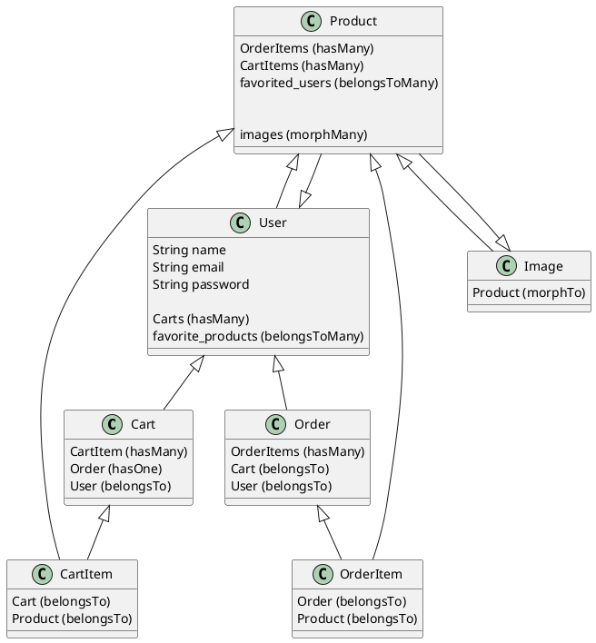

# 購物車的 UML

```plantuml
@startuml
Cart <|-- CartItem
Order <|-- OrderItem
Product <|-- CartItem
Product <|-- OrderItem
User <|-- Cart
User <|-- Order
User <|-- Product
Product <|-- User
Product <|-- Image
Image <|-- Product


class Product {
  {field} OrderItems (hasMany)
  {field} CartItems (hasMany)
  {field} favorited_users (belongsToMany)
    
    
  {field} images (morphMany)
}

class Image {
  {field} Product (morphTo)
}

class User {
    String name
    String email
    String password
    
  {field} Carts (hasMany)
  {field} favorite_products (belongsToMany)
}

class Cart {
  {field} CartItem (hasMany)
  {field} Order (hasOne)
  {field} User (belongsTo)
}

class CartItem {
  {field} Cart (belongsTo)
  {field} Product (belongsTo)
}

class Order {
  {field} OrderItems (hasMany)
  {field} Cart (belongsTo)
  {field} User (belongsTo)
}

class OrderItem {
  {field} Order (belongsTo)
  {field} Product (belongsTo)
}

@enduml
```